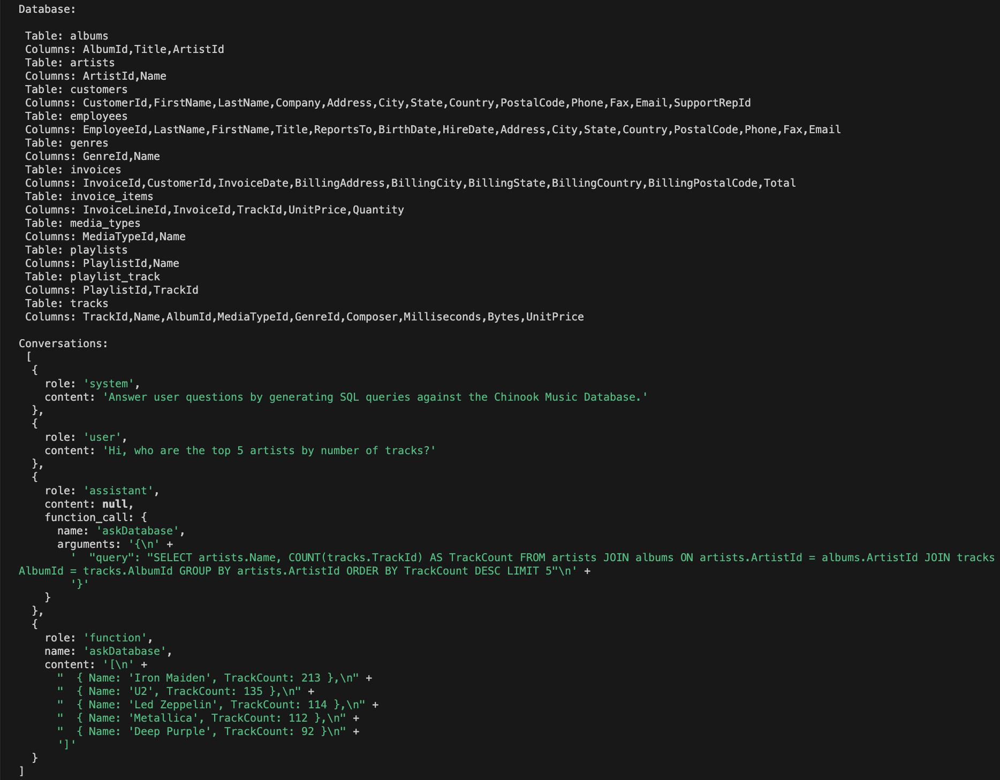

# NaturalSQL

A demo to using natural language to query SQLite DB

# About

This repository contains code that combines SQLite querying with OpenAI's GPT-3.5-turbo language model. The code allows users to interact with a SQLite database using natural language queries through a chat-like interface.

## Features

- Connects to a SQLite database (`chinook.db`) using the `sqlite3` library.
- Utilizes OpenAI's GPT-3.5-turbo language model for natural language processing.
- Supports querying the database by generating SQL queries based on natural language.
- Retrieves table and column information from the database to assist with query generation.
- Allows users to ask questions about the music database and receive SQL query responses.

## Installation

1. Clone this repository to your local machine:

   ```bash
   git clone git@github.com:JackZong/NaturalSQL.git
   ```

2. Install the necessary dependencies:

   ```bash
   yarn install
   ```

3. Configure the API key and base path by editing the `config.json` file:

   ```json
   {
     "apiKey": "<your_open_ai_api_key>",
     "basePath": "<base_path>",
     // if you are using rapid open ai APIs, this demo based on Rapid API's open ai APIs
     "rapidApiKey": "<your_rapid_api_key>",
     "rapidHost": "<rapid_host>"
   }
   ```

## Usage

1. Ensure that the SQLite database (`chinook.db`) is located in the `./db` directory.

2. Start the application:

   ```bash
   yarn start
   ```

3. The application will connect to the database and retrieve the table and column information.

4. The application will use OpenAI's GPT-3.5-turbo language model to generate an SQL query based on the hard-code natural language.

5. The SQL query will be executed against the SQLite database, and the results will be displayed in the console.

## Example



## TODO

- [ ] Supports to send message based on user inputs.

## License

This project is licensed under the [MIT License](LICENSE).

## Acknowledgments

- [OpenAI](https://openai.com/) for providing the GPT-3.5-turbo language model.
- The [Chinook Sample Database](https://www.sqlitetutorial.net/sqlite-sample-database/) for the music database used in this example.
- [SQLite Node SDK](https://www.sqlitetutorial.net/sqlite-nodejs/connect/) for using node sdk to connect with SQLite
- [How to use ChatGPT call functions](https://github.com/openai/openai-cookbook/blob/main/examples/How_to_call_functions_with_chat_models.ipynb)
- [SQLite](https://www.sqlite.org/) for the powerful and lightweight database engine.
